# Phishing Simulation Lab: GoPhish, OSINT & Credential Harvesting

An end-to-end phishing campaign built and run from scratch: a GoPhish server hidden behind an Nginx reverse proxy, passive OSINT with theHarvester, a credential-harvesting landing page, and a full campaign fired against a fictional organization, tracked from *email sent* all the way to *credentials captured in cleartext*. Every email stays inside the lab.
 
 ## Demo


   
This is the **human-factor layer** of my home lab. My [OS Bunker](.) lab hardened a Linux box (prevention), my [AWS Hardening](.) lab did the same in the cloud, and my [Wazuh SIEM](.) lab answered "if someone gets in, do I see it?" (detection). This one attacks the layer none of those cover: the person reading the email. No exploit, no CVE, just a convincing message and a fake login page.

## Ethical Scope & Authorization

This is the first thing, not a footnote, because the scope *is* the difference between a phishing lab and a crime.

- **No real person was ever targeted.** The campaign ran exclusively against a **fictional company (Nortek Soluciones S.A.)** and test mailboxes I control. Every "victim" is an invented persona.
- **No email left the lab.** Mailpit acts as a catch-all SMTP sink: it captures everything GoPhish sends and never delivers to a real inbox.
- **OSINT was passive only.** The reconnaissance queried public data sources (Certificate Transparency logs, search engines) and performed **no active scanning and no interaction with any target's infrastructure**.
- **The whole environment is disposable** and runs on my own isolated VMs.

## What This Proves

- I stand up a complete phishing infrastructure (GoPhish + Nginx + TLS + an SMTP sink) instead of clicking through a hosted tool.
- I hide the offensive tooling the way an operator would: TLS-terminating reverse proxy, and stripping the headers that fingerprint GoPhish.
- I run passive OSINT with real tooling and turn it into an email-naming convention and a target list.
- I build a credential-harvesting landing page that actually captures, and I know *why* the naive clone of a modern login page fails.
- I write a pretext deliberately, mapping each element to a known social-engineering principle.
- I read the results like a report: delivery, open, click and submit rates, and I'm honest about what the numbers do and don't mean.
- I close with the defensive side, because the point of red-team work is to make the blue side better.

## The Attack Chain

```
   [Kali]  passive OSINT (theHarvester: crt.sh, search engines)
      │        → email-naming convention → target list
      ▼
 ┌─────────────────────────── Ubuntu Server (hardened) ───────────────────────────┐
 │                                                                                 │
 │   GoPhish admin  ── 127.0.0.1:3333 (TLS) ──►  reached over SSH tunnel only      │
 │                                                                                 │
 │   Email Template ──┐                                                            │
 │   Landing Page  ──┼──►  Campaign  ──►  GoPhish phishing server (127.0.0.1:8080) │
 │   Sending Profile ─┘                          ▲                                 │
 │                                               │ proxy_pass + strip X-Gophish-*  │
 │                          Nginx  :443 (TLS) ───┘ + more_clear_headers Server     │
 │                            ▲                                                     │
 └────────────────────────────┼────────────────────────────────────────────────────┘
                              │ https://192.168.0.221/?rid=<unique>
                              │
      Email ──► Mailpit (SMTP sink :1025 / web UI :8025)
                  │
                  ▼
      "victim" opens mail ──► clicks ──► fake M365 login ──► submits creds
                  │
                  ▼
      GoPhish logs: Email Sent → Opened → Clicked → Submitted Data
                  └──► credentials stored in cleartext + redirect to real login
```

The management interface is bound to localhost and only reachable through an SSH tunnel, so the GoPhish admin panel is never exposed on the network. Nginx is the only public face, on 443, serving the landing over HTTPS with the GoPhish fingerprint headers removed.

## Technologies Used

- **GoPhish 0.12.1** — phishing campaign framework (admin panel, templates, landing pages, tracking)
- **Nginx** + `headers-more` module — TLS-terminating reverse proxy and header stripping
- **Mailpit** — SMTP catch-all sink (SMTP :1025, web UI :8025), so nothing is delivered externally
- **theHarvester 4.10.1** — passive OSINT (Certificate Transparency, search engines)
- **OpenSSL** — self-signed certificate for the landing (no domain in this lab)
- **Ubuntu Server** (hardened) — attacker infrastructure host
- **Kali Linux** — OSINT / operator workstation
- **OpenSSH** — management access and SSH port forwarding from a Windows host

## Environment

| Component | Details |
|---|---|
| GoPhish + Nginx + Mailpit | Ubuntu Server (hardened), `192.168.0.221`, bridged |
| OSINT workstation | Kali Linux, `192.168.0.77`, bridged |
| Operator host | Windows, connects to both over SSH (tunnel for the admin panel) |
| Admin panel | `127.0.0.1:3333` (TLS), localhost-only, reached via `ssh -L 3333:127.0.0.1:3333` |
| Phishing server | `127.0.0.1:8080`, behind Nginx |
| Public entry point | Nginx `:443` (TLS), landing served here |
| Mail delivery | Mailpit sink — no external delivery |
| Target org | Nortek Soluciones S.A. (fictional), 8 invented personas |

The default GoPhish admin credential is auto-generated on first launch and was **rotated immediately** after the first login.

## Skills Demonstrated

- Deploying and configuring a phishing framework from the release binary
- Reverse-proxying an application behind Nginx with TLS termination
- Defensive-evasion basics: removing tool-identifying HTTP headers (`X-Gophish-Contact`, `X-Gophish-Signature`, `Server`)
- Binding a sensitive admin interface to localhost and reaching it over an SSH tunnel
- Passive OSINT and turning recon into an attack artifact (email convention, target list)
- Building a credential-harvesting page and understanding why static clones of JS-driven logins fail
- Pretext design mapped to social-engineering principles (authority, urgency, plausibility)
- Reading campaign telemetry and reporting metrics honestly
- Translating findings into blue-team mitigations (MFA, DMARC/SPF/DKIM, awareness, reporting)

## Methodology

| Phase | Focus | Result |
|---|---|---|
| 1 | GoPhish infrastructure | Server up, admin panel over SSH tunnel, default credential rotated |
| 2 | Nginx reverse proxy | TLS on 443, `Server` and `X-Gophish-*` headers stripped |
| 3 | Sending profile (Mailpit) | Send pipeline confirmed, nothing leaves the lab |
| 4 | Passive OSINT | 667 hosts / 39 IPs from public sources; target list built |
| 5 | Landing page + email template | Working credential capture + M365 migration pretext |
| 6 | Target group | 8 Nortek personas loaded |
| 7 | Campaign execution | Full funnel: Sent → Opened → Clicked → Submitted (cleartext creds) |

---

## Phase 1 · GoPhish Infrastructure

GoPhish ships as a single binary with a JSON config. Two changes to `config.json` before first launch:

- `admin_server.listen_url` kept at `127.0.0.1:3333` — the management panel stays on localhost.
- `phish_server.listen_url` set to `127.0.0.1:8080` — the phishing server also on localhost, so Nginx (Phase 2) becomes the only public face.

On first launch GoPhish auto-generates an admin password and prints it once. I copied it, logged in, and **rotated it immediately** — a default credential on the operator's own console is exactly the kind of thing this lab is about.

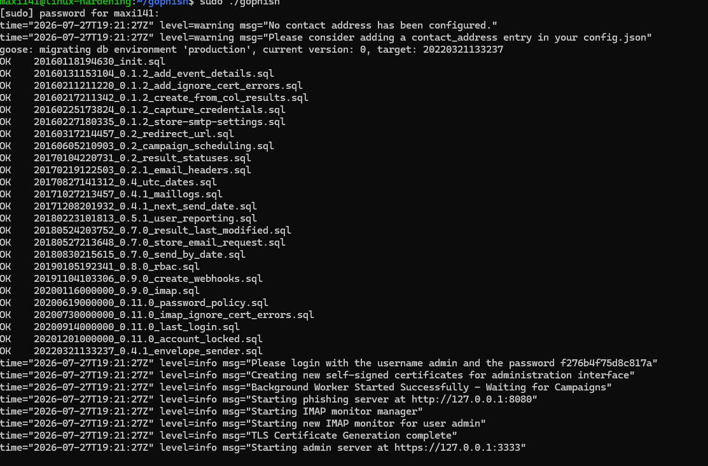
*First launch: auto-generated admin password and the phishing/admin servers starting.*

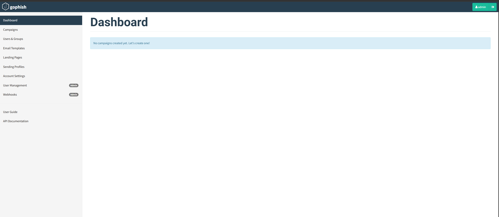
*Authenticated dashboard, no campaigns yet.*

Because the panel is bound to localhost on a headless server, I reach it from the Windows host with an SSH tunnel:

```powershell
ssh -L 3333:127.0.0.1:3333 maxi141@192.168.0.221
# then browse https://127.0.0.1:3333
```

## Phase 2 · Nginx Reverse Proxy (Hiding the Tooling)

By default GoPhish is easy to fingerprint. The goal here is that the only thing on the network is a plain HTTPS server that gives nothing away. Nginx terminates TLS on 443 and forwards to GoPhish on `127.0.0.1:8080`, and I strip the identifying headers. (Full config in [`config/nginx-gophish.conf`](config/nginx-gophish.conf).)

```nginx
location / {
    proxy_pass http://127.0.0.1:8080;
    proxy_hide_header X-Gophish-Contact;
    proxy_hide_header X-Gophish-Signature;
    more_clear_headers Server;      # requires libnginx-mod-http-headers-more-filter
}
```

`server_tokens off` alone only hides the *version*; the `Server: nginx` token still leaks. The `headers-more` module (`more_clear_headers Server`) removes it entirely — confirmed by comparing `curl -I` against the direct backend versus through the proxy: the proxied response no longer carries a `Server` header.

**Honest note on `X-Gophish-Contact`:** GoPhish only emits that header on real phishing responses (a campaign URL carrying a valid `rid`), not on a bare `404` to `/`. So the correct place to *prove* it is stripped is against a live campaign URL, not a plain request. The `proxy_hide_header` rules are in place and do their job when the header is actually present.

## Phase 3 · Sending Profile with Mailpit

Mailpit is an SMTP sink: it accepts everything GoPhish sends and shows it in a web UI, but **never delivers to a real inbox**. This is what keeps the lab ethically clean while still exercising the full send path.

```bash
./mailpit --smtp 127.0.0.1:1025 --listen 127.0.0.1:8025
```

The GoPhish sending profile points at `127.0.0.1:1025`, no auth.

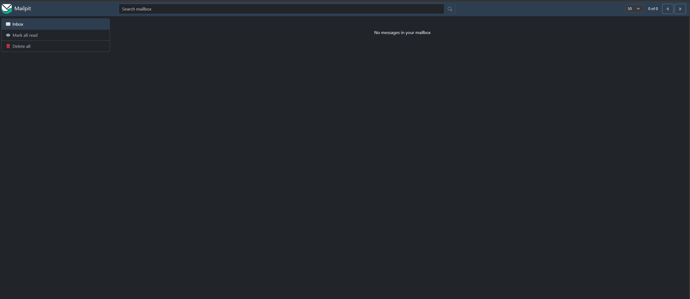
*Mailpit inbox empty, sink ready.*

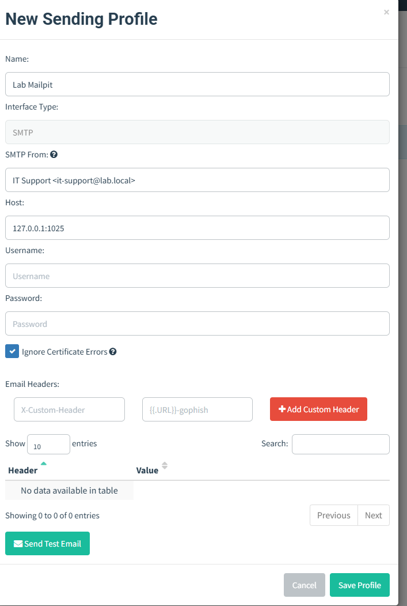
*Sending profile `Lab Mailpit` pointing at the Mailpit SMTP sink.*

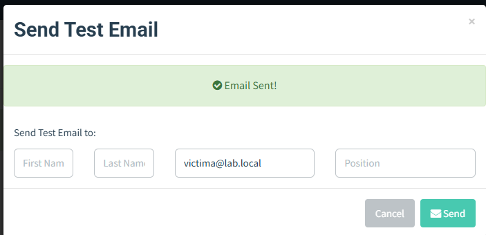
*Test email sent successfully.*

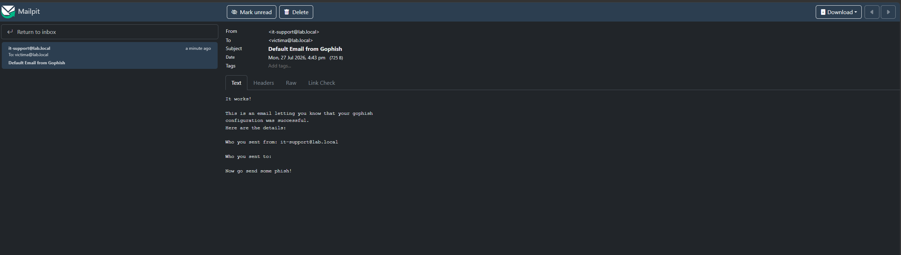
*The same email captured in Mailpit. The send pipeline works end to end and nothing left the lab.*

**Footgun hit here:** Mailpit rejected the first test with `501 5.5.4 invalid FROM parameter`. GoPhish's *test email* uses the display-name form (`IT Support <it-support@lab.local>`) in the envelope, which Mailpit refuses. A bare address (`it-support@lab.local`) fixes it. The display-name form works fine in the actual campaign — only the quick test is strict.

## Phase 4 · Passive OSINT

Reconnaissance from the Kali box with theHarvester, using only public sources (Certificate Transparency via crt.sh, plus search engines). No packet ever touches a target.

```bash
theHarvester -d <domain> -b crtsh,duckduckgo,hackertarget,otx,rapiddns,urlscan -f recon_microsoft
```

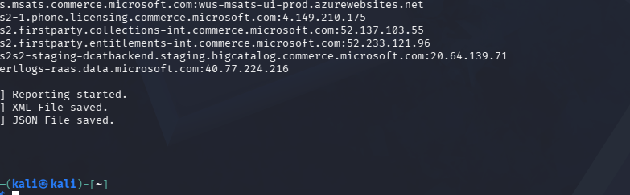
*theHarvester enumerating subdomains and hosts, results saved to JSON/XML.*

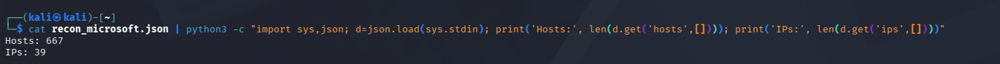
*Result summary: 667 hosts / 39 IPs from public sources alone.*

> Tooling note: `bing` is no longer a supported source in theHarvester 4.10.1 and aborts the whole run with `Invalid source` — removed it from the `-b` list. `theHarvester -h` lists the valid sources per version.

The point of this phase for the campaign is not the raw host list — it's the **email-naming convention**. Passive recon is how an attacker infers that an org uses `firstname.lastname@domain`, which is exactly the format applied to the target list. Full output in [`evidence/recon/`](evidence/recon/).

## Phase 5 · Landing Page + Email Template

### Landing page (credential capture)

The interesting lesson of the whole lab lives here. My first landing was a direct import of `login.microsoftonline.com`. It rendered, but on submit it showed *"There was an issue looking up your account"* and never reached the password step. That's not a misconfiguration — the modern Microsoft login is a **JavaScript SPA that does a live server-side account lookup** before showing the password field. A static clone can't complete that flow, so it never captures a password.

The fix is a **single-page login** with username and password on one form that GoPhish can intercept directly ([`config/landing-m365.html`](config/landing-m365.html)). Reliable capture, and for a portfolio it's cleaner than mirroring a real brand's page byte-for-byte.

One more detail that silently breaks capture: a cloned page often carries `<base href="https://login.microsoftonline.com"/>`, which makes the form POST resolve against the *real* Microsoft server instead of the landing. Stripping the `<base>` tag is what keeps the submission local so GoPhish can capture it.

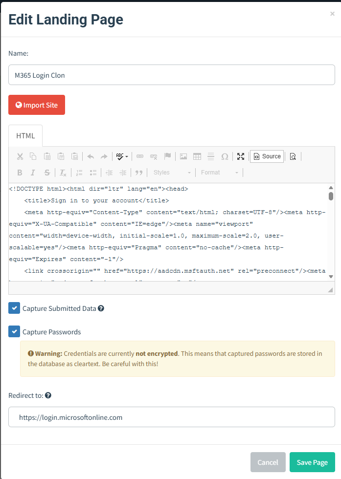
*Landing page editor: capture enabled, and GoPhish's own warning that captured credentials are stored in cleartext.*

### Email template (the pretext)

A Microsoft-365-migration "re-verification" notice from "IT". Two GoPhish variables do the work: `{{.FirstName}}` personalizes each email, and `{{.URL}}` is replaced with the per-recipient tracking link. `{{.Tracker}}` (the tracking pixel) records opens.


*Rendered template with the Microsoft header, the "Verificar mi cuenta" button, and the tracking pixel.*

**Pretext design (deliberate, not decorative):**

| Element | Principle |
|---|---|
| Microsoft branding + "Departamento de TI" | **Authority** |
| "before July 30" + "account will be suspended" | **Urgency / loss aversion** |
| M365 migrations are real and common | **Plausibility** |
| "If you don't recognize this, contact IT" | A false escape hatch that paradoxically *raises* credibility |

## Phase 6 · Target Group

The 8 Nortek personas loaded into GoPhish, with `firstname.lastname@nortek-sa.com` (the convention that connects back to Phase 4) and each person's role. The list is in [`targets/targets_nortek.csv`](targets/targets_nortek.csv).

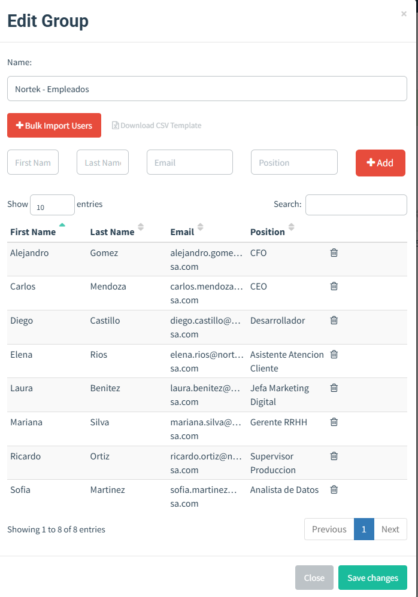
*The `Nortek - Empleados` group, 8 targets.*

Capturing **Position** matters: it lets results be segmented by role later (executive vs technical), which turns "I counted clicks" into "I analyzed risk by profile".

## Phase 7 · Campaign Execution

The campaign wires template + landing + sending profile together. The **URL** field (`https://192.168.0.221`) is what GoPhish injects into `{{.URL}}` — clicking the button routes the victim through **Nginx (443, TLS, clean headers)** to the landing. This is where Phases 2 and 5 connect.

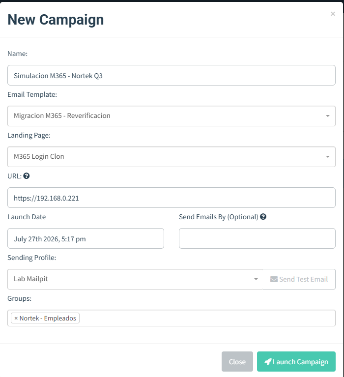
*Campaign configuration: template + landing + Nginx URL + Mailpit sending profile.*

Acting as the victim, I opened a captured email in Mailpit, clicked through to the landing, and submitted test credentials. GoPhish recorded the full funnel — **Email Sent → Opened → Clicked → Submitted Data** — with per-event metadata (Windows 10, Chrome, timestamps), and stored the credentials.

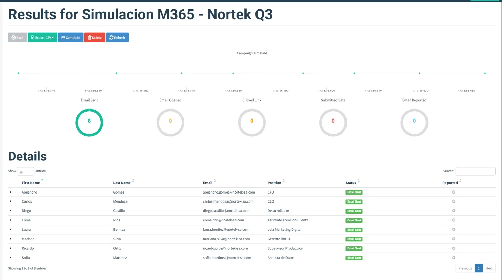
*Campaign dashboard: the Sent → Opened → Clicked → Submitted funnel.*

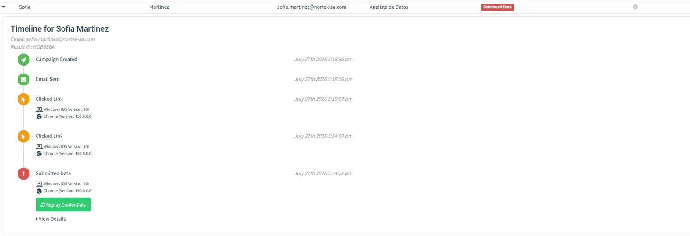
*Per-victim timeline: Campaign Created → Email Sent → Clicked → Submitted Data, with OS, browser and timestamps.*

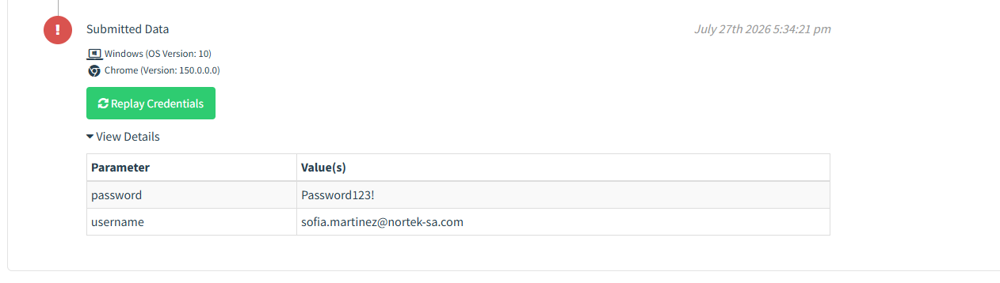
*Captured credentials in cleartext on the attacker server (`username` + `password`). This is the impact the entire report is built around.*

## Results

| Metric | Value |
|---|---|
| Delivery rate | 8 / 8 (100%) |
| Open rate | 2 / 8 |
| Click rate | 1 / 8 |
| Credential submission | 1 / 8 |
| Report rate | 0 / 8 |

**Honest reading of the numbers:** this ran in a controlled environment with a single operator acting as the test victim, so the rates **demonstrate the mechanics of the compromise, not a population susceptibility rate**. Presenting these as real human-behavior statistics would be dishonest; what they prove is that the full chain — from a crafted email to a credential captured on the attacker's server — works.

The **0% report rate** is the most useful pointer for future work: in a real program, the percentage of users who *report* a phish is the metric that measures security culture, and enabling GoPhish's reporting workflow is the natural next step.

## Mitigations (Blue-Team View)

The reason to run the attack is to make the defense concrete. Ranked roughly by impact against this exact scenario:

- **Phishing-resistant MFA (FIDO2 / passkeys).** The single highest-value control: even with the password captured in cleartext, a second factor blocks the login. This is what turns a successful phish into a non-event.
- **Email authentication — SPF, DKIM, DMARC (`p=reject`).** Prevents an attacker from spoofing the organization's own domain, which is the most convincing version of this pretext.
- **Security-awareness training + an ongoing simulated-phishing program**, so users recognize the urgency/authority pattern and know the "verify credentials by email" ask is always wrong.
- **Email gateway controls** — link rewriting, URL/attachment sandboxing, and flagging newly-registered or look-alike domains.
- **Conditional access / impossible-travel detection**, to catch stolen credentials being used from an unexpected location even if MFA is somehow satisfied.
- **A one-click "report phishing" button.** Directly addresses the 0% report rate and shortens incident response.

## Lessons Learned

- **A static clone of a modern login page won't capture credentials.** `login.microsoftonline.com` is a JS SPA with a live account lookup; the password field never appears in a static copy. A single-page login form captures reliably.
- **`<base href>` silently sends your loot to the real site.** A cloned page's `<base>` tag makes the form POST resolve against the original domain — strip it or capture nothing.
- **Prove header-stripping against a real campaign URL.** `X-Gophish-Contact` only appears on genuine phishing responses, not on a bare `404`, so testing against `/` is misleading.
- **`Server: nginx` needs `headers-more`.** `server_tokens off` only hides the version; removing the token entirely takes the extra module.
- **Bind the admin panel to localhost and tunnel in.** Keeping the management interface off the network is cheap and correct, and the SSH tunnel fits a headless server perfectly.
- **Small envelope quirks matter.** Mailpit's `501` on a display-name `FROM` cost a few minutes until I read the error rather than the config.

## Future Work

- Register a look-alike domain with proper SPF/DKIM to test real deliverability and how it fares against spam filtering (the current lab has no domain and uses a self-signed cert).
- Enable GoPhish's **reporting workflow** to measure report rate, the metric that best reflects security culture.
- **Per-role pretext segmentation** (a BEC-style lure for the CFO, a repo-access lure for the developer) instead of one universal pretext.
- Add MFA to a target account and **demonstrate the captured credential failing** — closing the loop from attack to mitigation.
- Script the teardown and a one-command redeploy.

## Repository Structure

```
gophish-phishing-simulation-lab/
├── README.md
├── config/
│   ├── nginx-gophish.conf      # reverse proxy: TLS + header stripping
│   └── landing-m365.html       # single-page login clone (reliable capture)
├── targets/
│   └── targets_nortek.csv      # fictional target list (Nortek personas)
└── evidence/
    ├── recon/
    │   ├── recon_microsoft.json   # theHarvester passive OSINT output
    │   └── recon_microsoft.xml
    └── screenshots/               # deploy → credential capture
        ├── phase1-gophish-first-launch-password.png   Auto-generated admin password (rotated)
        ├── phase1-dashboard-authenticated.png         Authenticated dashboard, no campaigns yet
        ├── phase3-mailpit-empty-inbox.png             Mailpit SMTP sink ready
        ├── phase3-sending-profile-mailpit.png         Sending profile → 127.0.0.1:1025
        ├── phase3-test-email-sent.png                 Test email sent successfully
        ├── phase3-test-email-captured-mailpit.png     Captured in Mailpit — nothing left the lab
        ├── phase4-theharvester-recon.png              Passive recon (crt.sh + search engines)
        ├── phase4-recon-summary-667-hosts.png         667 hosts / 39 IPs from public sources
        ├── phase5-landing-page-capture-enabled.png    Landing: capture enabled + cleartext warning
        ├── phase5-email-template-pretext.png          Email template: M365 migration pretext
        ├── phase6-target-group-nortek.png             Target group — 8 personas loaded
        ├── phase7-campaign-configuration.png          Campaign config (template + landing + URL)
        ├── phase7-campaign-results-funnel.png         Sent → Opened → Clicked → Submitted funnel
        ├── phase7-victim-timeline-sofia.png           Per-victim timeline with OS/browser/timestamps
        └── phase7-captured-credentials-cleartext.png  Captured credentials in cleartext
```

---

**Disclaimer:** This lab was conducted in an isolated, personal virtual environment for educational purposes only. The only "organization" targeted is fictional, all mailboxes are test accounts under my control, no email was delivered outside the lab, and all reconnaissance used public data sources with no active scanning. No real person, system, or data was involved.
